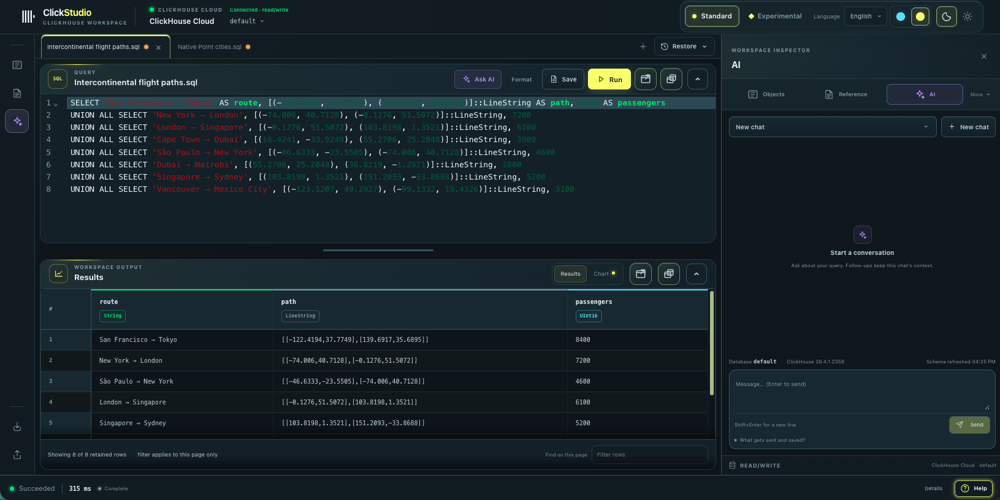
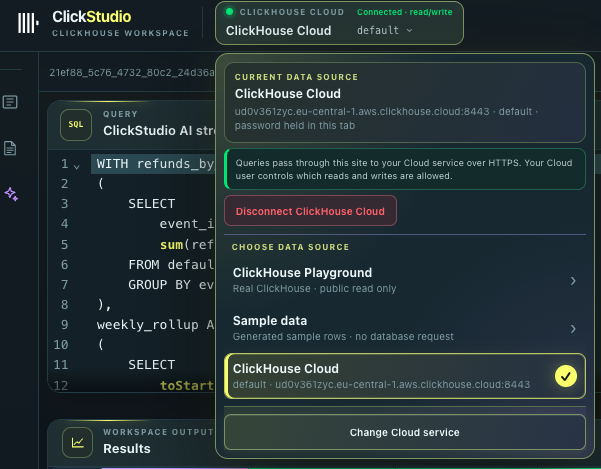
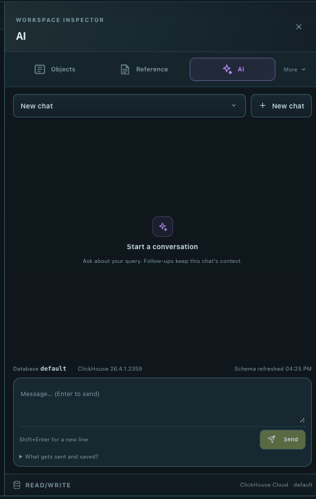

# ClickStudio

ClickStudio is a SQL editor for ClickHouse. Write queries, explore results, build charts, and inspect query runs.

Try the [live ClickStudio app, hosted on Vercel](https://clickstudio-eight.vercel.app/).

Each saved run keeps its SQL, parameters, limits, and results together. Reopen a run to review its details.

The app uses React, Click UI, and CodeMirror. The server sets limits for query time, memory, and result size.

## How ClickStudio meets the assignment

### 1. Run a query and display its results

Choose a data source, write one SQL statement, and select **Run**. ClickStudio runs it on the selected ClickHouse connection and shows its status. When it finishes, the **Results** table shows the returned rows, column names, and ClickHouse data types. You can move through result pages and reopen a saved run with its SQL, parameters, limits, and results.

### 2. Display a chart from query results

After a query runs, select **Chart** beside **Results**. ClickStudio uses the rows from that run and suggests a chart based on the result columns. You can choose a number, line, bar, scatter, heatmap, or candlestick chart, then adjust its axes, measures, and groups. The chart uses the returned data and does not send another query. Results without numeric measures can show row counts; the table stays available beside the chart.

### 3. Run a SQL script and display each result

Write several SQL statements in the editor and select **Run**. ClickStudio splits the script into statements and runs them in order, up to 50 statements per script. **Results** shows each statement's status. Select a completed statement to view its own query result. By default, the script stops after the first statement fails. Script execution is available when the selected connection supports it.

### Bonus: Insert rows from a file

Choose **Import** and select a CSV, JSON, NDJSON, or JSONL data file, up to 2 MB and 10,000 rows. Preview the rows, choose an existing table, map or skip columns, and review the row and column summary before selecting **Import rows**. For ClickHouse Cloud, you can also create a MergeTree table and set its column types. ClickHouse checks the permissions for the selected operation. In the hosted sample workspace, imported rows stay in the browser's `demo.interview_imports` dataset.

## Explore ClickStudio

*Write queries, review results, and ask the AI assistant in one workspace.*

Start with the sample workspace, then choose a live data source when you are ready:

- **ClickHouse Playground** runs SQL on public data with read-only access.
- **ClickHouse Cloud** connects to your own service.

*Choose the public Playground or connect your own ClickHouse Cloud service.*

## Quick start

Install **Node.js 22.12 or newer** and npm. Docker runs the optional local ClickHouse server.

From the repository folder, install the app and create your local settings file:

    npm run setup
    cd clickstudio
    npm run init:env

This creates a local sign-in token in the settings file.

### Sample workspace

From the clickstudio folder, start the sample workspace:

    DEMO_MODE=true npm run dev

Open http://localhost:5173 and choose **Start exploring**. Explore example results, charts, and query plans.

### ClickHouse Playground or Cloud

From the clickstudio folder, start the standard workspace:

    npm run dev

Sign in with `CLICKSTUDIO_TOKEN` from `.env`. Open the data source menu and choose **ClickHouse Playground** to query public, read-only data.

To connect your Cloud service, choose **Connect ClickHouse Cloud** and enter the HTTPS host, database, username, and password. The password stays in this browser tab’s memory and clears when you reload or disconnect. ClickStudio sends it to its server, which connects to Cloud over HTTPS. Your ClickHouse user’s permissions control available actions.

### AI assistant

The AI assistant uses an OpenAI API key. Add your key to the .env file:

    OPENAI_API_KEY=your-openai-api-key

Replace `your-openai-api-key` with your key.

Leave `OPENAI_MODEL` empty to use the default model, or set a model supported by your OpenAI account. Restart the workspace after updating the key:

    npm run dev

Open the **AI** tab and follow the prompts to load the schema. The server reads the key from `.env`, keeping it out of browser settings.

Open **What gets sent and saved?** in the AI panel to review the information used for a request. It can include your message, chat history, SQL, table and column names, and recent query results. Review each SQL suggestion before applying or running it.

*Set an OpenAI key and connect to a data source to use the AI panel.*

### Local ClickHouse

From the clickstudio folder, start the optional local database:

    docker compose up -d --wait clickhouse
    npm run db:setup
    npm run dev

Open http://localhost:5173, sign in with `CLICKSTUDIO_TOKEN` from `.env`, then choose **Test connection** and **Trust connection**. Enter `local` when asked.

The setup adds sample data to `default.events`. Try this query:

    SELECT day, events
    FROM default.events
    ORDER BY day;

The menu beside **Run statement** has **EXPLAIN INDEXES**, **EXPLAIN PLAN**, **EXPLAIN PIPELINE**, and **EXPLAIN ANALYZE**. ClickHouse 26.7 or newer supports **EXPLAIN ANALYZE**. The bundled ClickHouse 24.6 server supports the other query plan views.

### Example files

- [analysis.sql](clickstudio/examples/analysis.sql): example queries, parameters, and query plans.
- [import.csv](clickstudio/examples/import.csv): sample rows for default.import_events.
- [connections.json](clickstudio/examples/connections.json): settings for more than one connection.

## Main features

- **Choose a workspace mode.** Standard keeps the workspace focused. Experimental adds SQL maps, execution insights, parser settings, and more controls.
- **Write SQL.** Format and check queries. Run one query or a script with results for each statement.
- **Explore data.** Browse databases, tables, columns, system docs, and MergeTree data parts.
- **View results.** See column types and result pages. Build charts and save query documents.
- **Import files.** Preview CSV, JSON, and NDJSON files. Map columns and check the row count before import.
- **Inspect query runs.** Track progress, cancel queries, reopen run details, and view query plans and runtime charts.
- **Use the AI assistant.** Review information sent to AI and choose which SQL suggestions to apply or run.

## Checks

Run the project checks from the repository folder:

    npm run check

Run the main browser checks from the clickstudio folder:

    npm run test:e2e:core

For ClickHouse integration checks, start the local database first. Then run these commands from the clickstudio folder:

    CLICKHOUSE_INTEGRATION=1 npm run test:integration
    npm run eval

## More guides

- [Setup and implementation guide](docs/CLICKSTUDIO.md): setup, settings, and details.
- [SQL editing tools](docs/EDITOR-TOOLS.md): navigation, snippets, and autocomplete.
- [ClickHouse exploration workflows](clickstudio/docs/native-explorers.md): objects, MergeTree activity, and query comparisons.
